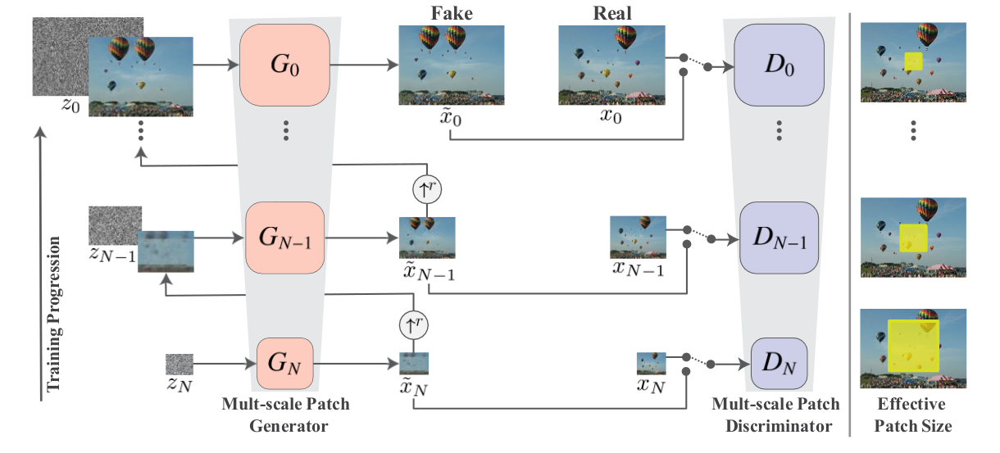

# SinGAN: Learning a Generative Model from a Single Natural Image

## NOTE
This repository is not the official implementation. The official implementation can be found here [SinGAN Official Pytorch implementation](https://github.com/tamarott/SinGAN).

This repository is based off the following implementation of SinGAN: [SinGAN FriedRonaldo](https://github.com/FriedRonaldo/SinGAN). The full pipeline gets hooked up to a trained CartoonGAN model, which is built off of the following repo: [CartoonGAN Yijunmaverick](https://github.com/Yijunmaverick/CartoonGAN-Test-Pytorch-Torch).

## SinGAN's Model and our Goal
Capturing the distribution of complex datasets is a task that is still considered a challenge despite continuous performance and quality increases experienced by GANs trained on visual data. In order to resolve this issue, traditional models focus on training the GAN on different input signals or training the model to do a specific task. SinGAN aims to resolve these issues: it is capable of generating new samples of arbitrary size and aspect ratio that look distinct from the original photo, but still conveys the same visual information and maintains the general global structures that the photo contains. This approach is not limited to texture images like some models are, and is unconditional (i.e. generates the samples via random noise). It does all this while maintaining good results, as seen by it easily fooling human vision in [Section 3.1 of their paper](https://arxiv.org/pdf/1905.01164.pdf). It accomplishes this but using a pyramidal pipeline of fully convolutional GANs, each of which attempt to learn the patch distribution of the image at a different scale, as seen below:



However, the model itself injects noise into the outputted image, leading to noise being propagated through systems one may want to parse the output to, such as other GANs. One potential way of resolving this is the approach we took in this repository, where we perform denoising on the outputted images prior to inputting it into other models. However, while this greatly increases the results of the output in models like CartoonGAN, there are still signs of artifacting and noise propagation that could be improved upon. 


By manipulating the model, training it multiple times at different granularities, or fusing its outputs carefully, you can achieve the image modification results that are discussed in the official paper - however, this repository mainly focuses on the raw outputs of the model (similar to the [FriedRonaldo]() impelementation) and aims to show a potential way of allowing the results to be used for other purposes where fine-grained quality greatly matters, e.g. data augmentation.


## Input and Output
The input for our model is arbitrary sized images. To try and replicate the results of the paper, and to obtain better consistency, we trained and ran models that were trained on images from the official dataset used the authors of SinGAN. These input images were primarily PNG files, and typically had a resolution near 250x250.

The model outputs two things: the raw output of the SinGAN model, and stylized images from processing denoised versions of said images through CartoonGAN. The size of the outputted images are variable according to arguments, but due to hardware limitations and desiring consistency the results we discuss are primarily 250x250, similar to the majority of the results in the paper.


  
## Folder Hierarchy
  Images that you wish to train on should be placed in the trainPhoto and testPhoto directories, as seen below in the example hierarchy.

  * Directory hierarchy :
  ```
  Project
  |--- data
  |    |--- SinGANdata
  |         |--- trainPhoto
  |         |    |--- balloons.png
  |         |    |--- birds.png
  |         |    |--- ... other images used in the official paper
  |         |    
  |         |--- trainPhoto
  |         |    |--- yourPhoto.png
  |         |
  |         |--- testPhoto
  |              |--- yourPhoto.png
  |
  |--- code
       |--- cartoonGAN
       |    |--- pretrained_model
       |         |--- Hayao_net_G_float.pth
       |         |--- ...
       |
       |--- models
       |        |--- ...
       |
       |--- results
       |    |--- ...
       |
       |--- test_output
       |    |--- ...
       |
       |--- main.py 
       |--- train.py
       | ...
       
  ```
   
## How to Run via Code
### Conda Environment
#### 1. Install Conda if not already installed
See [here](https://docs.anaconda.com/anaconda/install/) for instructions on installation

#### 2. Create the conda environment from the provided YML file
```
conda env create -f environment.yml
```
#### 3. Activate the environment
```
conda activate singan
```

#### 3a. Install remaining packages via pip
For some reason, the YML file doesn't always install the pip packages listed in the YML file. So run the following to make sure you have all the other packages you need:
```
pip install -r requirements.txt
```

#### 4. Run the code as desired, as seen in the following sections

### Arguments
   * gantype
       * Loss type of GANs. You can choose among "wgangp, zerogp, lsgan". Recommend to use "zerogp".
   * model_name
       * Prefix of the directory of log files.
   * workers
       * Workers to use for loading dataset.
   * batch_size
       * Size of batch, it is fixed to "1". SinGAN uses only one image.
   * val_batch
       * Size of batch in validation, it is fixed to "1". SinGAN uses only one image.
   * img_size_max
       * Size of largest image. = Finest
   * img_size_min
       * Size of smallest image. = Coarsest
   * img_to_use
       * Index of the image to use. If you do not change, it will be sampled randomly.
   * load_model
       * Directory of the model to load.
   * validation
       * Validation mode
   * gpu
       * GPU number to use. You should set. Unless it utilizes all the available GPUs.

SinGAN uses only one image to train and test. Therefore multi-gpus mode is not supported.
   
### Train
Use NS loss with zero-cented GP and 0-th gpu. The train image will be selected randomly. It will generate (1052, 1052) images at last.
```
python main.py --gpu 0 --gantype zerogp --img_size_max 250
```


Use WGAN-GP loss to train and 0-th gpu.
```
python main.py --gpu 0 --img_to_use 0 --img_size_max 250 --gantype wgangp
```


### Test trained model, e.g. SinGAN_2020-03-13_12-04-40
Note that when using this option, you should take care to choose the `img_to_use` flag to be the indexed photo of the photo in `trainData` unless you desire to input a custom image into the model purposes other than generating variations of the training image. If you are unsure what image it was trained on, you can check the log folder for the `record.txt` file, which will specify whih IMGTOUSE was chosen. So long as files have not been moved around in the trainPhoto and testPhoto folders, this should be the proper index to use.
```
python main.py --gpu 0 --img_to_use 0 --img_size_max 250 --gantype zerogp --validation --load_model SinGAN_2020-03-13_12-04-40
```


### Manually run CartoonGAN on a trained model's results, e.g. SinGAN_2020-03-13_12-04-40
```
      python ./cartoonGAN/test.py --input_dir ./results/SinGAN_2020-03-02_20-39-53 --gpu 0 --mod_name SinGAN_2020-03-02_20-39-53
```

## Results

By now, you have either trained your new model or have ran a pretrained model and want to see the results from it.
If you have trained a new model, the saved model can be found under `logs`, as seen below. Images that were output during the training/validation process can be found under `results/SinGAN_2020-03-02_20-39-53` for raw output, and `test_output/results/SinGAN_2020-03-02_20-39-53` for the images that have been denoised and processed through CartoonGAN.
```
  Project
  |--- data
  |    |--- SinGANdata
  |         |--- paper_photos
  |         |--- trainPhoto
  |         |--- testPhoto
  |
  |--- code
       |--- cartoonGAN
       |    |--- pretrained_model
       |         |--- Hayao_net_G_float.pth
       |         |--- ...
       |
       |---datasets
       |--- logs
       |    |---SinGAN_2020-03-02_20-39-53
       |    |--- ...
       |
       |--- models
       |        |--- generator.py
       |        |--- ...
       |
       |--- results
       |    |--- SinGAN_2020-03-02_20-39-53
       |         |--- Gen_0_0.png
       |         |--- ... more images from trained model
       |
       |--- test_output
       |    |--- denoised_images
       |    |--- results
       |         |--- SinGAN_2020-03-02_20-39-53
       |              |--- Hayao
       |              |--- Hosoda
       |              |--- Paprika
       |              |--- Shinkai
       |
       |--- main.py 
       |--- train.py
       | ...
       
```